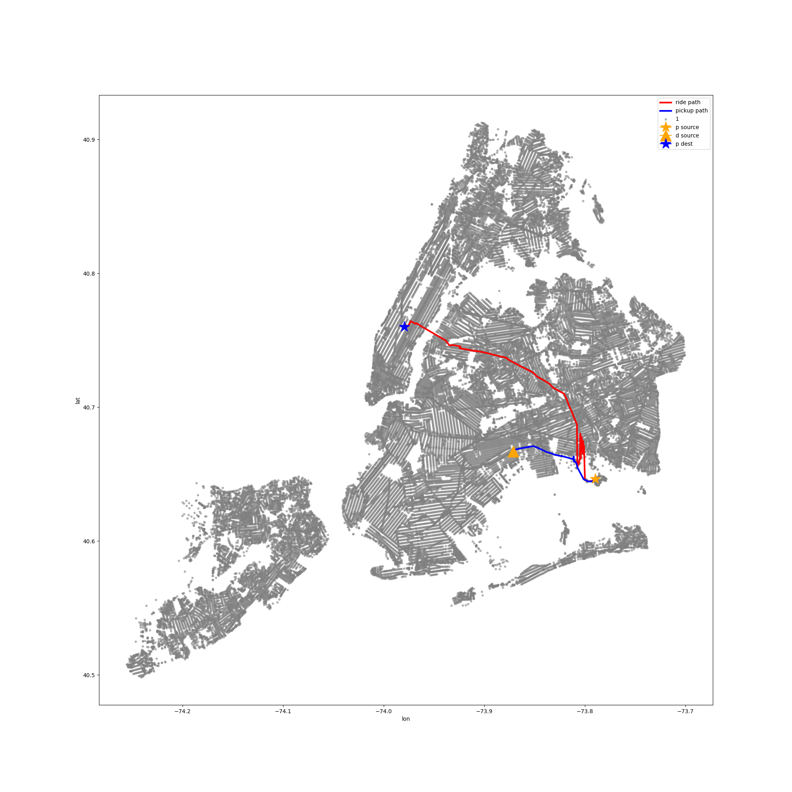

# CS330 Design and Analysis of Algorithms - Casestudy Project

To better understand algorithms covered in this class, we were tasked with the following problem statement: With your brand new bachelors degree in computer science from Duke University, you have taken a job in the “Data-Driven Algorithms Design Group” of the new company NotUber (NU for short). NU runs a service in New York City where passengers request rides through a mobile app. Drivers registered with NU sign into the app whenever they want to drive. So far NU has been subcontracting to another taxi dispatcher to make real-time assignments of drivers to passengers. Your group has been tasked with designing the next generation algorithmicsystem for automating these decisions.

Our group implemented 5 different methods to find the most efficient way to match drivers with passengers across the NYC area. 

1. A brute force method that matched the first available passenger with the first available driver. 
2. Look at all available drivers, and compute the stright line distance to longest-waiting passenger. The minimum straight line distance computed will match that driver with the passenger.  
3. Look at shortest drive time to match driver and passenger. (Dijkstra's) 
4. Employ a preprocessing of all NYC nodes to make find nearest node of passenger and driver easier (KD Tree), and use a faster shortest-path method (A*) match drivers and passengers.
5. Looked at drivers within 10 minutes of finishing their ride and all available drivers using the method in 4 to minimize passenger wait time and maximize driver profit. 

To run all of our code, you can use Jupyter notebook or VSCode to open up each of the `.ipynb` and run all of the cells. Take a look at our presentation [here](330_Case_Study_Presentation.pdf) .

### Representation of our shortest path algorithm. 

